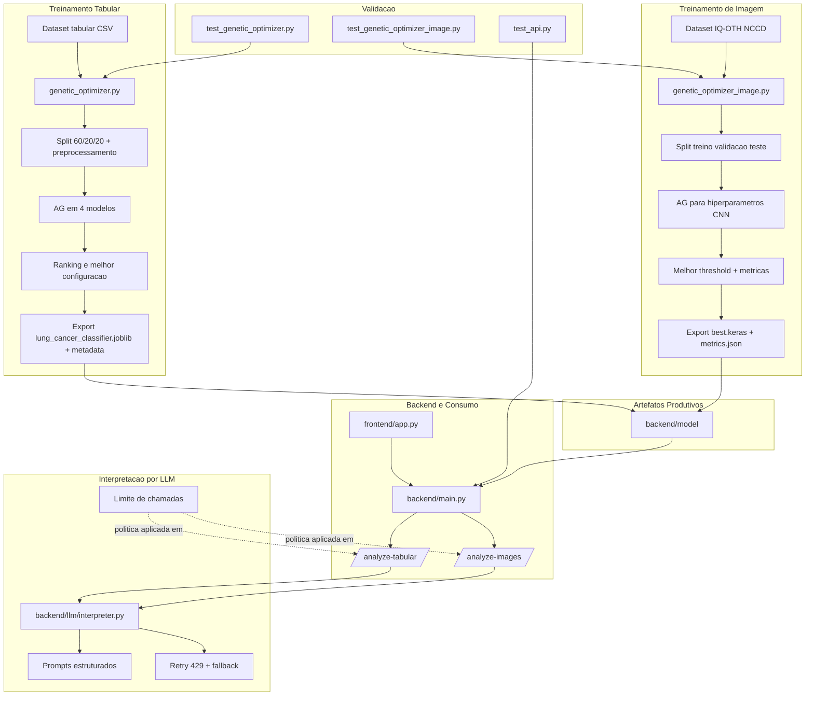

# Relatorio Tecnico Consolidado - AG, API, LLM e Avaliacao

## 1. Escopo da Entrega

Esta entrega cobre cinco frentes integradas:

1. implementacao do Algoritmo Genetico (AG) para otimizacao de hiperparametros;
2. exportacao produtiva dos melhores artefatos para a API;
3. testes automatizados do nucleo do AG e da API;
4. resiliencia do cliente Gemini com controle de chamadas e tratamento de falhas `429`;
5. avaliacao da qualidade das interpretacoes geradas pela LLM.

## 2. Arquivos Canonicos da Solucao

### 2.1 Codigo

- `train_model/genetic_optimizer.py`: AG tabular para classificadores sklearn.
- `train_model/genetic_optimizer_image.py`: AG para o fluxo de visao computacional.
- `backend/main.py`: carga dos artefatos produtivos e endpoints da API.
- `backend/llm/interpreter.py`: prompts, retries, fallback e integracao Gemini.
- `tests/test_genetic_optimizer.py`: testes do AG tabular.
- `tests/test_genetic_optimizer_image.py`: testes leves do AG de imagem.
- `tests/test_api.py`: testes automatizados da API tabular.

### 2.2 Artefatos Gerados

- `train_model/ga_optimization_results.json`
- `train_model/ga_image_optimization_results.json`
- `backend/model/lung_cancer_classifier.joblib`
- `backend/model/lung_cancer_classifier.metadata.json`
- `backend/model/best.keras`
- `backend/model/best_info.json`
- `backend/model/metrics.json`

## 3. Arquitetura Integrada



## 4. Logica e Estrutura do Algoritmo Genetico

### 4.1 Fluxo tabular

O AG tabular foi implementado em `train_model/genetic_optimizer.py` para quatro classificadores:

- `RandomForestClassifier`
- `LogisticRegression`
- `KNeighborsClassifier`
- `ExtraTreesClassifier`

Estrutura do processo:

1. carregar o dataset tabular e realizar split `60/20/20`;
2. construir pipeline com preprocessamento sklearn;
3. definir espaco de busca por modelo;
4. gerar populacao inicial aleatoria;
5. avaliar individuos com funcao de fitness orientada a recall, especificidade, F1 e penalidade de fairness;
6. aplicar selecao por torneio, crossover uniforme, mutacao e elitismo;
7. consolidar o melhor individuo por experimento;
8. exportar o melhor artefato produtivo para `backend/model/lung_cancer_classifier.joblib`.

Funcao de fitness tabular:

```text
fitness = 0.6 * recall + 0.2 * specificity + 0.2 * f1 - 0.5 * fairness_penalty
```

Com:

- `fairness_penalty = max(recall_por_grupo) - min(recall_por_grupo)`
- grupo monitorado: `GENDER`

### 4.2 Fluxo de imagem

O AG de imagem foi implementado em `train_model/genetic_optimizer_image.py` para ajustar o treinamento de uma CNN baseada em `EfficientNetB0`.

Hiperparametros pesquisados:

- `learning_rate`
- `batch_size`
- `frozen_epochs`
- `fine_tune_epochs`
- `dense_units`
- `dropout_rate`
- `use_class_weight`
- `unfreeze_layers`

Fluxo resumido:

1. extrair o dataset IQ-OTH/NCCD;
2. construir splits de treino, validacao e teste;
3. treinar candidatos com congelamento inicial e fine-tuning controlado;
4. escolher o melhor threshold no conjunto de validacao;
5. avaliar no conjunto de teste;
6. calcular fitness orientado a `recall`, `specificity`, `f1` e `auc_roc`;
7. exportar o melhor modelo para `backend/model/best.keras`.

Funcao de fitness de imagem:

```text
fitness = 0.45 * recall + 0.20 * specificity + 0.20 * f1 + 0.15 * auc_roc
```

## 5. Configuracao Experimental

### 5.1 Tabular

Dataset tabular:

- total: `3000` amostras
- treino: `1800`
- validacao: `600`
- teste: `600`

Experimentos executados:

| Experimento | Populacao | Geracoes | Crossover | Mutacao | Seed |
|---|---:|---:|---:|---:|---:|
| exp1 | 8 | 3 | 0.8 | 0.1 | 1 |
| exp2 | 8 | 3 | 0.8 | 0.3 | 2 |
| exp3 | 12 | 3 | 0.8 | 0.1 | 3 |

### 5.2 Imagem

Dataset de imagem:

- total: `1097` imagens
- treino: `767`
- validacao: `165`
- teste: `165`

Experimentos executados:

| Experimento | Populacao | Geracoes | Crossover | Mutacao | Seed |
|---|---:|---:|---:|---:|---:|
| exp1 | 2 | 1 | 0.8 | 0.15 | 11 |
| exp2 | 2 | 1 | 0.8 | 0.30 | 22 |
| exp3 | 3 | 2 | 0.8 | 0.20 | 33 |

## 6. Resultados Consolidados do AG Tabular

### 6.1 Ranking final

| Posicao | Modelo | Melhor experimento | Fitness |
|---|---|---|---:|
| 1 | RandomForestClassifier | exp3 | `0.5551` |
| 2 | KNeighborsClassifier | exp2 | `0.5456` |
| 3 | LogisticRegression | exp3 | `0.5119` |
| 4 | ExtraTreesClassifier | exp3 | `0.5073` |

Melhor modelo global:

- modelo: `RandomForestClassifier`
- experimento vencedor: `exp3`
- fitness de validacao: `0.5550641876345416`

### 6.2 Melhores hiperparametros por modelo

**RandomForestClassifier**

```python
{
  "n_estimators": 221,
  "max_depth": 27,
  "min_samples_split": 3,
  "min_samples_leaf": 2,
  "max_features": 0.8308
}
```

**KNeighborsClassifier**

```python
{
  "n_neighbors": 9,
  "weights": "uniform",
  "p": 2
}
```

**LogisticRegression**

```python
{
  "C": 0.1613,
  "penalty": "l1",
  "solver": "saga",
  "class_weight": None,
  "max_iter": 256
}
```

**ExtraTreesClassifier**

```python
{
  "n_estimators": 118,
  "max_depth": 18,
  "min_samples_split": 3,
  "min_samples_leaf": 1,
  "max_features": 0.9362
}
```

## 7. Comparativo de Performance - Original vs Otimizado via AG

As metricas desta secao consolidam a comparacao entre os modelos em configuracao original e suas melhores configuracoes encontradas pelo AG. Os dados foram extraidos do fluxo comparativo documentado em `train_model/ag_analise_cancer.ipynb`.

| Modelo | Original acc | AG acc | Delta acc | Original recall | AG recall | Delta recall | Original spec | AG spec | Delta spec | Original F1 | AG F1 | Delta F1 | Melhor exp |
|---|---:|---:|---:|---:|---:|---:|---:|---:|---:|---:|---:|---:|---|
| RandomForestClassifier | `0.5367` | `0.5483` | `+0.0116` | `0.5493` | `0.6086` | `+0.0592` | `0.5236` | `0.4865` | `-0.0372` | `0.5458` | `0.5772` | `+0.0315` | `exp3` |
| LogisticRegression | `0.5200` | `0.5183` | `-0.0017` | `0.5822` | `0.5691` | `-0.0132` | `0.4561` | `0.4662` | `+0.0101` | `0.5514` | `0.5449` | `-0.0065` | `exp2` |
| KNeighborsClassifier | `0.5050` | `0.5033` | `-0.0017` | `0.5164` | `0.5263` | `+0.0099` | `0.4932` | `0.4797` | `-0.0135` | `0.5139` | `0.5178` | `+0.0039` | `exp3` |
| ExtraTreesClassifier | `0.5317` | `0.5233` | `-0.0083` | `0.5395` | `0.5362` | `-0.0033` | `0.5236` | `0.5101` | `-0.0135` | `0.5386` | `0.5327` | `-0.0059` | `exp3` |

Leitura tecnica:

- o `RandomForestClassifier` foi o modelo com ganho mais claro apos otimizacao, melhorando `accuracy`, `recall` e `F1`;
- o `KNeighborsClassifier` manteve desempenho competitivo e apresentou a menor penalidade de fairness na validacao (`0.0011`);
- `LogisticRegression` e `ExtraTreesClassifier` nao superaram seus baselines em todas as metricas, o que reforca que o AG deve ser analisado por objetivo clinico e nao apenas por acuracia isolada;
- o criterio de selecao final priorizou sensibilidade e equilibrio de fairness, nao apenas a melhor pontuacao de teste.

## 8. Artefato Tabular Exportado para Uso Produtivo

O AG exportou automaticamente o melhor pipeline tabular para a API:

- artefato: `backend/model/lung_cancer_classifier.joblib`
- metadados: `backend/model/lung_cancer_classifier.metadata.json`
- threshold selecionado na validacao: `0.15`

Resumo do artefato exportado:

- modelo: `RandomForestClassifier`
- hiperparametros: `n_estimators=221`, `max_depth=27`, `min_samples_split=3`, `min_samples_leaf=2`, `max_features=0.8308`
- recall de validacao no threshold selecionado: `1.0`
- metricas de teste com threshold produtivo:
  - accuracy: `0.5050`
  - precision: `0.5050`
  - recall: `1.0000`
  - specificity: `0.0000`
  - f1: `0.6711`

Interpretacao tecnica:

- o threshold produtivo foi ajustado para maximizar recall na triagem;
- isso melhora a sensibilidade, mas praticamente elimina a especificidade;
- portanto, o artefato exportado e intencionalmente conservador para rastreio, e nao para confirmacao diagnostica.

## 9. Resultados Consolidados do AG de Imagem

| Experimento | Fitness | Accuracy teste | Recall teste | Specificity teste | F1 teste | AUC teste |
|---|---:|---:|---:|---:|---:|---:|
| exp1 | `0.9781` | `0.9697` | `0.9881` | `0.9506` | `0.9708` | `0.9947` |
| exp2 | `0.9630` | `0.9455` | `0.9881` | `0.9012` | `0.9486` | `0.9891` |
| exp3 | `0.9696` | `0.9697` | `0.9524` | `0.9877` | `0.9697` | `0.9968` |

Melhor experimento de imagem:

- experimento vencedor: `exp1`
- fitness: `0.9781247099229556`
- threshold selecionado: `0.10`
- hiperparametros:
  - `learning_rate=0.000142`
  - `batch_size=16`
  - `frozen_epochs=3`
  - `fine_tune_epochs=1`
  - `dense_units=64`
  - `dropout_rate=0.4412`
  - `use_class_weight=False`
  - `unfreeze_layers=40`

Artefatos exportados para a API:

- `backend/model/best.keras`
- `backend/model/best_info.json`
- `backend/model/metrics.json`

Resumo do artefato de imagem exportado:

- backbone: `EfficientNetB0`
- threshold: `0.10`
- metricas de teste:
  - accuracy: `0.9697`
  - precision: `0.9540`
  - recall: `0.9881`
  - specificity: `0.9506`
  - f1: `0.9708`
  - auc_roc: `0.9947`

## 10. Integracao com LLMs

### 10.1 Abordagem de prompting

O arquivo `backend/llm/interpreter.py` define prompts estruturados para os dois fluxos:

- interpretacao tabular;
- interpretacao de imagem.

Os prompts compartilham as seguintes regras:

- formato obrigatorio com `Resumo`, `Risco`, `Justificativa`, `Recomendacao` e `Observacao`;
- proibicao de afirmar diagnostico fechado;
- obrigatoriedade de explicitar que a saida nao substitui avaliacao medica;
- linguagem objetiva e direcionada a profissionais de saude;
- recomendacao proporcional ao nivel de risco;
- proibicao de markdown e listas para manter padronizacao de saida.

No fluxo de imagem, o prompt ainda reforca que a interpretacao e baseada apenas na analise automatica da imagem e nao substitui laudo radiologico.

### 10.2 Limitacao de chamadas

O arquivo `backend/main.py` aplica controle de volume para chamadas da LLM:

- variavel de ambiente: `MAX_LLM_INTERPRETATIONS`
- valor padrao: `5`
- regra: apenas os primeiros registros de cada lote recebem interpretacao via Gemini;
- os demais recebem mensagem padrao informando a omissao para evitar excesso de chamadas.

Na avaliacao offline em `avaliation/llm_evaluation.ipynb`, tambem foi adotada estrategia conservadora:

- `SAMPLE_SIZE = 8`
- `SECONDS_BETWEEN_CALLS = 15`
- uso de cache em `avaliation/cached_interpretations.json`

Essa combinacao reduz risco de estouro da cota gratuita e melhora reprodutibilidade.

### 10.3 Tratamento de erros e resiliencia

O cliente Gemini foi refinado com foco em resiliencia operacional:

- inicializacao lazy do cliente;
- retry exponencial com jitter para erros `429`, `quota`, `resource_exhausted`, `rate limit` e `too many requests`;
- parametros configuraveis por ambiente:
  - `GEMINI_MODEL_NAME`
  - `GEMINI_MAX_RETRIES`
  - `GEMINI_RETRY_BASE_DELAY`
- fallback textual seguro quando:
  - a chave `GEMINI_API_KEY` nao esta configurada;
  - o pacote `google-genai` nao esta disponivel;
  - a API externa falha apos esgotar tentativas.

Com isso, a API continua respondendo mesmo sem dependencia obrigatoria da LLM.

## 11. Resultados da Avaliacao de Qualidade das Interpretacoes da LLM

Os resultados desta secao foram consolidados a partir de `avaliation/llm_evaluation.ipynb`.

### 11.1 Condicoes da avaliacao

- amostra planejada: `8` casos;
- interpretacoes efetivamente avaliadas: `3`;
- casos excluidos: `5`, por fallback associado a erro de API/quota;
- motor avaliado: `gemini-2.5-flash`;
- criterios qualitativos manuais: `clareza`, `coerencia`, `seguranca_clinica`, `utilidade_clinica`, `padronizacao`.

### 11.2 Conformidade automatica

- conformidade automatica media: `96.3%`
- melhor criterio automatico: `tem_secao_resumo` com `100%`
- pior criterio automatico: `tem_disclaimer_medico` com `67%`

Leitura:

- a LLM aderiu bem ao formato exigido e ao padrao estrutural dos prompts;
- a principal fragilidade automatica identificada foi a presenca inconsistente de disclaimer medico explicito.

### 11.3 Avaliacao qualitativa manual

| Criterio | Media | Desvio padrao | N avaliado |
|---|---:|---:|---:|
| clareza | `5.00` | `0.00` | 3 |
| coerencia | `4.00` | `1.00` | 3 |
| seguranca_clinica | `4.67` | `0.58` | 3 |
| utilidade_clinica | `2.67` | `2.08` | 3 |
| padronizacao | `3.67` | `1.53` | 3 |

Resumo qualitativo:

- nota media geral: `4.00/5`
- melhor criterio: `clareza` (`5.00`)
- pior criterio: `utilidade_clinica` (`2.67`)

Interpretacao:

- a LLM foi consistente na clareza e, em geral, segura do ponto de vista clinico;
- o ponto mais fraco foi utilidade clinica pratica, indicando que parte das respostas ficou generica e pouco acionavel;
- os resultados sao promissores como apoio textual, mas ainda pedem refinamento de prompt para recomendacoes mais especificas e uniformes.

### 11.4 Limitacoes da avaliacao

- o tamanho efetivo da amostra foi pequeno (`3` casos validos);
- houve impacto direto da cota gratuita da API, com `5 de 8` casos excluidos;
- portanto, os resultados devem ser lidos como uma avaliacao exploratoria inicial, e nao como validacao definitiva da qualidade da LLM.

## 12. Uso Produtivo na API

### 12.1 Tabular

O resultado produtivo do AG tabular entra na API por meio de:

- `backend/model/lung_cancer_classifier.joblib`
- carregamento em `backend/main.py`
- uso no endpoint `/analyze-tabular`

Ou seja, o `ga_optimization_results.json` e apenas relatorio, enquanto o `joblib` exportado e efetivamente consumido pela API.

### 12.2 Imagem

O resultado produtivo do AG de imagem entra na API por meio de:

- `backend/model/best.keras`
- carregamento resiliente em `backend/main.py`
- uso no endpoint `/analyze-images`

Assim, o AG de imagem tambem deixou de ser apenas analitico e passou a alimentar o fluxo produtivo do backend.

## 13. Testes e Validacao

Suíte automatizada:

- `tests/test_genetic_optimizer.py`
- `tests/test_genetic_optimizer_image.py`
- `tests/test_api.py`

Execucao validada:

```bash
python -m pytest -q
```

Resultado validado:

```text
8 passed, 1 warning in 4.37s
```

## 14. Como Reproduzir

### 14.1 Rodar o AG tabular

```bash
python train_model/genetic_optimizer.py
```

### 14.2 Rodar o AG de imagem

```bash
py -3.11 -m venv .venv311_img
.\.venv311_img\Scripts\python -m pip install -r requirements.txt
.\.venv311_img\Scripts\python train_model\genetic_optimizer_image.py
```

### 14.3 Rodar os testes

```bash
python -m pytest -q
```

## 15. Proximos Passos Recomendados

1. recalibrar o threshold produtivo do modelo tabular para reduzir falsos positivos;
2. aumentar populacao e numero de geracoes do AG para melhor exploracao;
3. adicionar teste automatizado para o endpoint `/analyze-images`;
4. reforcar o prompt medico para elevar `utilidade_clinica` e padronizacao;
5. ampliar a avaliacao da LLM com amostra maior e menor dependencia da cota gratuita;
6. versionar artefatos e experimentos com rastreabilidade por hash e data.

## 16. Status Final

- AG tabular: concluido
- AG de imagem: concluido
- exportacao produtiva de artefatos: concluido
- retries Gemini e fallback: concluido
- testes automatizados: concluido
- avaliacao inicial da qualidade da LLM: concluida
- consolidacao documental em relatorio unico: concluida

Ultima atualizacao: `2026-07-12`
